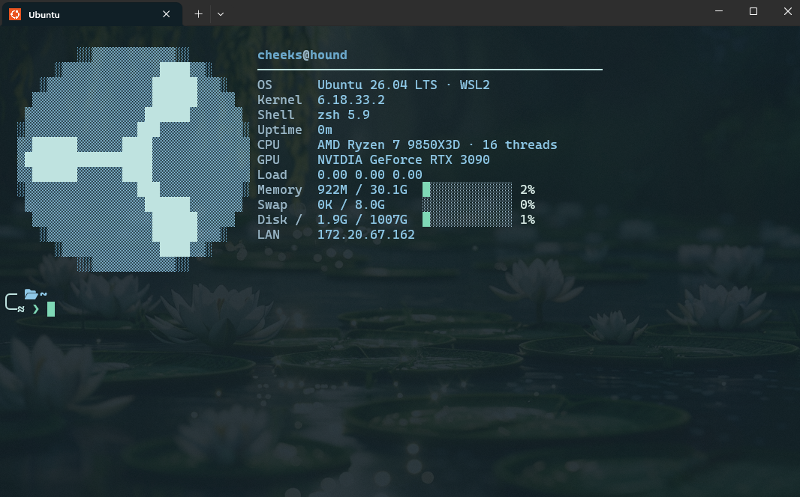

# pond

A calm two-line [oh-my-zsh](https://ohmyz.sh/) theme in pastel greens and blues.



The prompt sits at the bottom left. Annotated, with a dirty tree and a slow
command:

```
╭─  ~/dev/project  on  main ✚1 ●2                          1.4s
╰─≈ ❯
```

The `≈` on the second line is the waterline. Soft coral is the only warm colour
in the palette and it appears solely on a non-zero exit status, so a failed
command is obvious at a glance without breaking the mood.

## Features

- **Pastel palette** — pale aqua frame, pastel blue path, lily-green branch,
  seafoam prompt. Truecolor, with hand-picked xterm-256 fallbacks when
  `$COLORTERM` is unset.
- **Git branch and status** — staged, modified, deleted, renamed, unmerged,
  untracked, stashed, ahead, behind, diverged.
- **Path truncation** — deep trees collapse to `first/…/last/three` instead of
  swallowing the line.
- **Command timing** — elapsed time appears on the right for commands that run
  longer than a threshold.
- **Context only when it matters** — `user@host` shows only over SSH,
  background-job count only when jobs exist, virtualenv only when active.

## Requirements

- zsh 5.3+ (tested on 5.9)
- oh-my-zsh
- A [Nerd Font](https://www.nerdfonts.com/) for the folder and branch glyphs.
  Everything else is plain Unicode. Without a Nerd Font you'll see two tofu
  boxes — set `POND_ICON_DIR=''` and `POND_ICON_BRANCH=''` to drop them.

## Install

```sh
git clone https://github.com/notreallycheeks/pond-zsh-theme.git
cp pond-zsh-theme/pond.zsh-theme "${ZSH_CUSTOM:-$HOME/.oh-my-zsh/custom}/themes/"
```

Then set the theme in `~/.zshrc` and reload:

```sh
ZSH_THEME="pond"
```

```sh
omz reload
```

## Configuration

Set any of these in `~/.zshrc` **before** `oh-my-zsh.sh` is sourced.

| Variable | Default | Effect |
| --- | --- | --- |
| `POND_SHOW_TIME` | `1` | Set `0` to disable the elapsed-time right prompt |
| `POND_TIME_MIN` | `3` | Seconds a command must run before its time is shown |
| `POND_SHOW_USER` | `auto` | `auto` (SSH only), `always`, or `never` |
| `POND_PROMPT_CHAR` | `❯` | The character you type at |
| `POND_ICON_DIR` | `` | Directory glyph |
| `POND_ICON_BRANCH` | `` | Git branch glyph |
| `POND_ICON_VENV` | `` | Virtualenv glyph |

The palette lives in the `POND` associative array at the top of the theme —
edit those hex values to retune it.

## Note on the git segment

oh-my-zsh computes `git_prompt_info` asynchronously by default, so the branch is
blank on the very first paint and filled in a moment later. This is oh-my-zsh
behaviour, not the theme's — the stock themes do it too. It mostly shows up when
scripting a prompt render rather than in normal use. To force the synchronous
path:

```sh
zstyle ':omz:alpha:lib:git' async-prompt no
```

## License

MIT. See [LICENSE](LICENSE).
